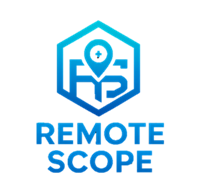

<p align="center">
  
</p>

<p align="center"><i>Sistema de Monitoreo Remoto de Dispositivos Android</i></p>

---

**Es una aplicación móvil desarrollada en Android que permite monitorear el estado de un dispositivo Android** de forma remota. Recolecta automáticamente datos como ubicación GPS, batería, almacenamiento, red y los expone a través de una **API REST embebida**, protegida por autenticación.

> 📁 Repositorio oficial: [https://github.com/DiegoCuaycal/Remote-Scope.git](https://github.com/DiegoCuaycal/Remote-Scope.git)
---

## ✨ Características principales

-  Recolección automática de datos GPS cada 30 segundos
-  Configuración personalizada de días y horas para recolección
-  Almacenamiento persistente usando **Room / SQLite**
-  Servidor HTTP embebido en el dispositivo con **NanoHTTPD**
-  API REST accesible desde red local
-  Autenticación segura por **Token o Usuario/Contraseña**
-  Interfaz simple para control y visualización en tiempo real

---

## 🛠️ Stack Tecnológico

| Componente          | Tecnología               |
|---------------------|---------------------------|
| Lenguaje            | Kotlin                    |
| IDE                 | Android Studio  
| Base de datos       | SQLite con Room           |
| Servidor HTTP       | NanoHTTPD                 |
| Autenticación       | Token + Basic Auth (Base64) |
| Comunicación        | API REST embebida         |
| Async               | Kotlin Coroutines         |

---

## ⚙️ Configuración y Ejecución

### Prerrequisitos

- Android Studio instalado
- Un dispositivo Android físico (recomendado) o emulador API 26+
- Conexión WiFi en red local (para pruebas remotas)

### Clonar el repositorio

```bash
git clone https://github.com/DiegoCuaycal/Remote-Scope.git
```

### Abrir el proyecto en Android Studio

- Abrir Android Studio
- Ir a File -> Open y seleccionar la carpeta del proyecto clonado
- Esperar a que Gradle sincronice todas las dependencias

### Configurar credenciales (opcional)

- Por defecto, se usan las siguientes credenciales:
  
```bash
Usuario: admin
Contraseña: 1234
Token: mi_token_secreto_123
```

### Ejecutar la aplicación

- Conecta tu dispositivo o ejecuta un emulador
- Haz clic en Run en Android Studio
- La aplicación se iniciará y mostrará la IP local en pantalla (ej: 192.168.1.150:8080)

## 🚀 Cómo Usar RemoteScope

1. **Iniciar monitoreo**  
   Presiona el botón **"Iniciar Recolección"** dentro de la aplicación para comenzar el servicio GPS y activar el servidor web embebido.

2. **Consultar API REST**  
   Desde un navegador web o herramienta como **Postman**, en una computadora conectada a la **misma red WiFi** que el dispositivo Android, accede a los endpoints expuestos por la API.


## 📡 Endpoints de la API

### Endpoint 1: Estado del Dispositivo

- **URL:** `http://<IP_DEL_DISPOSITIVO>:8080/api/device_status`
- **Método:** `GET`
- **Autenticación requerida:**
  - Opción 1 (Token):  
    Header → `Authorization: mi_token_secreto_123`
  - Opción 2 (Usuario y Contraseña):  
    Header → `usuario: admin`  
    Header → `contrasena: 1234`

#### Ejemplo con `curl`:
```bash
curl -X GET http://192.168.1.150:8080/api/device_status \
  -H "Authorization: mi_token_secreto_123"
```

### Endpoint 2: Datos del Sensor GPS

- **URL:** `http://<IP_DEL_DISPOSITIVO>:8080/api/sensor_data?start_time=<timestamp>&end_time=<timestamp>`
- **Método:** `GET`
- **Autenticación requerida:**
  - Opción 1 (Token):  
    Header → `Authorization: mi_token_secreto_123`
  - Opción 2 (Usuario y Contraseña):  
    Header → `usuario: admin`  
    Header → `contrasena: 1234`
- **Parámetros de la URL:**
  - start_time: Timestamp inicial (en milisegundos)
  - end_time: Timestamp final (en milisegundos)

#### Ejemplo con `curl`:
```bash
curl -X GET "http://192.168.1.150:8080/api/sensor_data?start_time=1690000000000&end_time=1990000000000" \
  -H "Authorization: mi_token_secreto_123"
```
## 📱 Captura de la Aplicación

A continuación se muestra una imagen de la aplicación **RemoteScope** en ejecución desde un dispositivo Android:

<p align="center">
  
</p>


## 📌 Consideraciones

- La aplicación debe estar en primer plano o con el servicio en ejecución para mantener activo el servidor.
- Es necesario conceder permisos de ubicación al instalar por primera vez.
- Verifica que el dispositivo y la PC estén en la misma red para que el API sea accesible.

## ✍️ Autor

- **Diego Cuaycal**  
  Estudiante de Ingeniería en Software - Universidad Técnica del Norte  
  GitHub: [@DiegoCuaycal](https://github.com/DiegoCuaycal)

## 📄 Licencia

- Este proyecto está licenciado bajo la Licencia MIT.  Consulta el archivo [LICENSE](./LICENSE) para más detalles.


